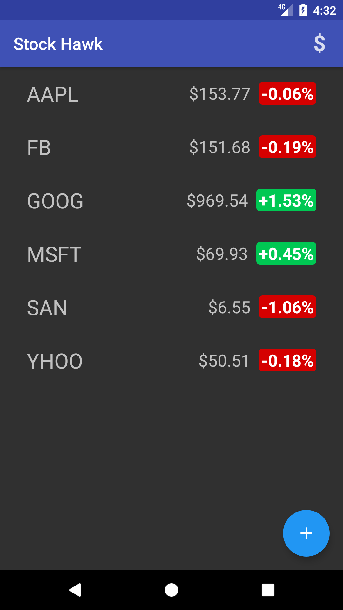
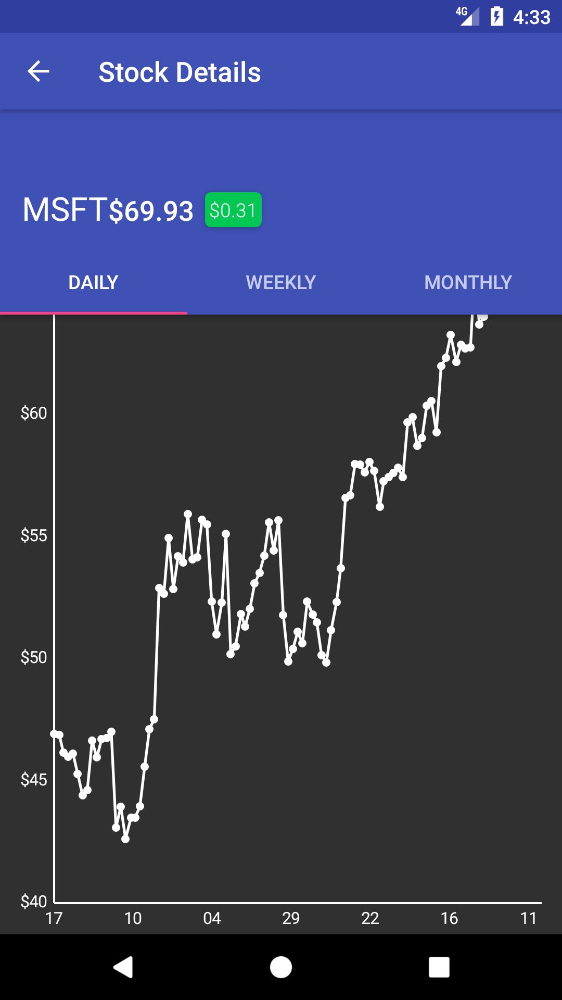
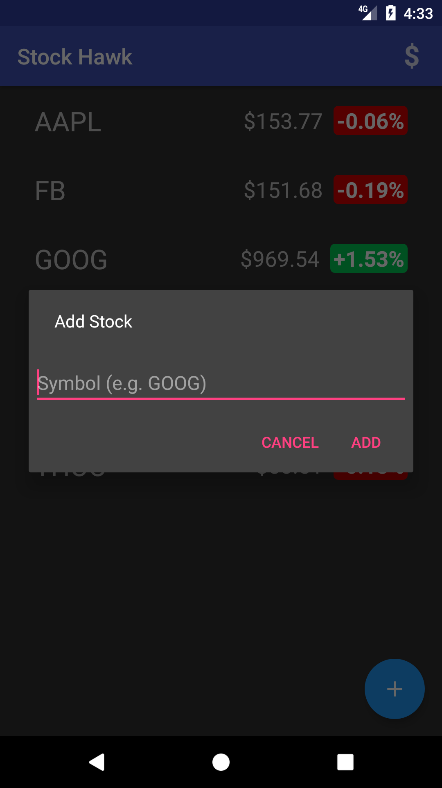
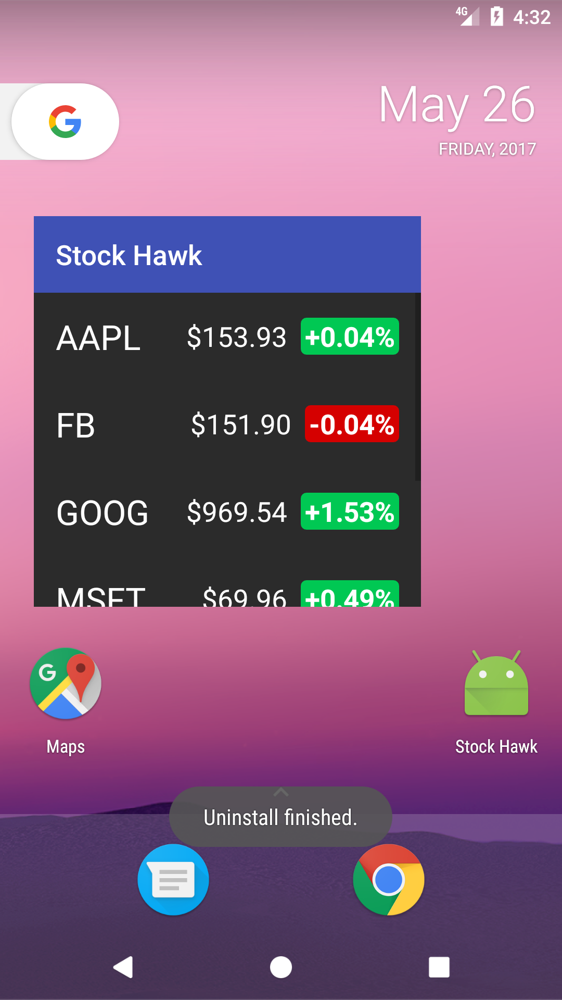

# Stock Hawk 

# Contrubuting

Pull requests gratefully accepted.

Stock Hawk
==================

A production-ready Android app that let user check stocks market, with data from Yahoo Finance API.
This is Project 3 in Udacity's [Associate Android Developer Fast Track Program](https://www.udacity.com/course/android-developer-nanodegree-by-google--nd801).

**Features:**

- Discover stock quotes with recent changes
- User can choose his favorite change format: **percentage** or **absolute**
- Each stock quote on the main screen is clickable and leads to a new screen which graphs the stock's value over time
- User can add a Stock Hawk widget on launch screen, displaying his favorite stock quotes in a simple and efficient way
- Fool-proof error handling
- Offline work

Screenshots
-----------

Developer setup
---------------

### Requirements

- Java 7 or 8
- Latest version of Android SDK and Android Build Tools

### Building

You can build the app with Android Studio or with `./gradlew assembleDebug` command.

License
-------

This project is released under The Unlicense, as shown in the [LICENSE][1] file.
[1]: LICENSE
